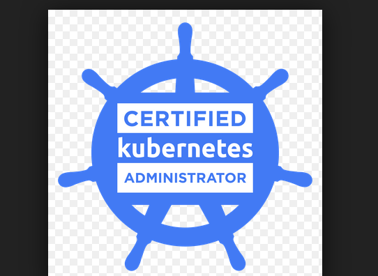

# CKA-Exercises

  

A set of curated exercises to help prepare you for the Certified Kubernetes Administrator Exam by the Cloud Native Computing Foundation

## Contributing

### Pull Request process
  - Fork the repo and create your branch from your forked repo
  - Please try to stick to the layout we follow in terms of the README markdown
  - Issue that PR
  - This will be reviewed by the team and merged

## Shortcuts and things to keep in mind when going through this repo

- NS = Namespace
- SA = Service account
- Po = Pod
- NetPol = Network policy
- PSP = Pod security policy
- RBAC = Role-based access control
- k = kubectl
- SVC = Service

## [Core Concepts)](1-Basics)

- Some basics of K8s and references to other useful repos

## [Storage](2-Storage)

- Understand storage classes, persistent volumes
- Understand volume mode, access modes and reclaim policies for volumes
- Understand persistent volume claims primitive
- Know how to configure applications with persistent storage

## [Troubleshooting](3-Troubleshooting)

- Evaluate cluster and node logging
- Understand how to monitor applications
- Manage container stdout & stderr logs
- Troubleshoot application failure
- Troubleshoot cluster component failure
- Troubleshoot networking

## [Workloads & Scheduling](4-Workloads-Scheduling)

- Understand deployments and how to perform rolling update and rollbacks
- Use ConfigMaps and Secrets to configure applications
- Know how to scale applications
- Understand the primitives used to create robust, self-healing, application deployments
- Understand how resource limits can affect Pod scheduling
- Awareness of manifest management and common templating tools

## [Cluster Architecture, Installation & Configuration](5-ClusterArchitecture-Installation-Configuration)

- Manage role based access control (RBAC)
- Use Kubeadm to install a basic cluster
- Manage a highly-available Kubernetes cluster
- Provision underlying infrastructure to deploy a Kubernetes cluster
- Perform a version upgrade on a Kubernetes cluster using Kubeadm
- Implement etcd backup and restore

## [Services & Networking](6-Services-Networking)

- Understand host networking configuration on the cluster nodes
- Understand connectivity between Pods
- Understand ClusterIP, NodePort, LoadBalancer service types and endpoints
- Know how to use Ingress controllers and Ingress resources
- Know how to configure and use CoreDNS
- Choose an appropriate container network interface plugin

## [Mock Exam Questions](7-mock-exam-questions)

- Practice mock exam questions.

## Useful resources and materials

### Further reading

### Other Useful repos
